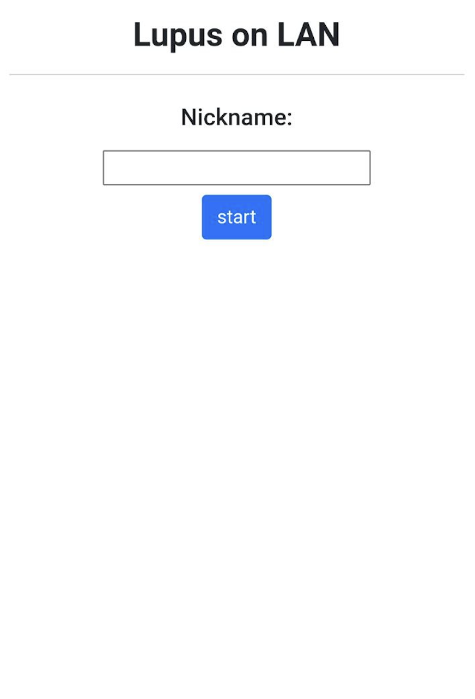
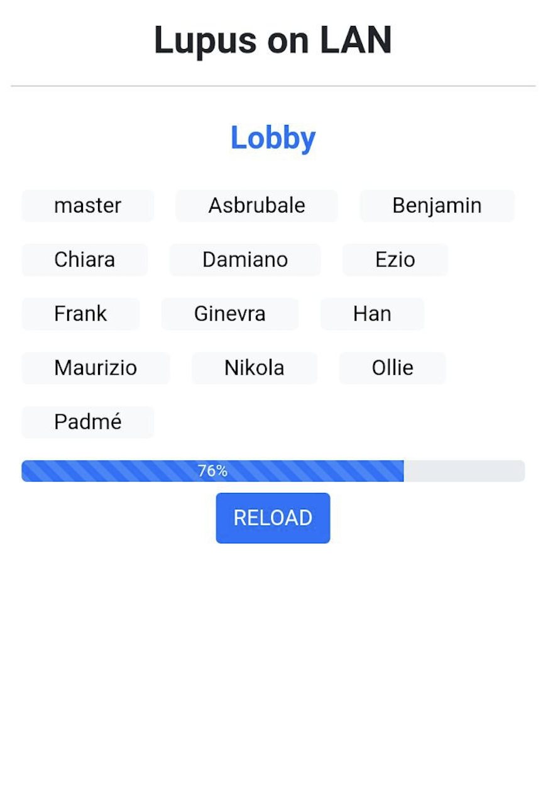
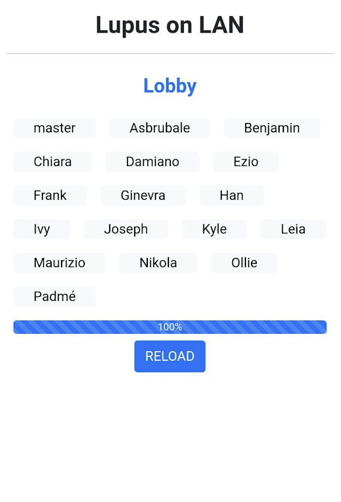
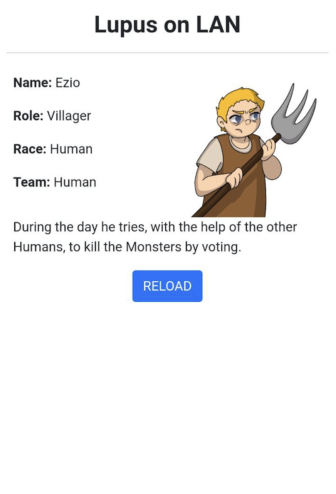
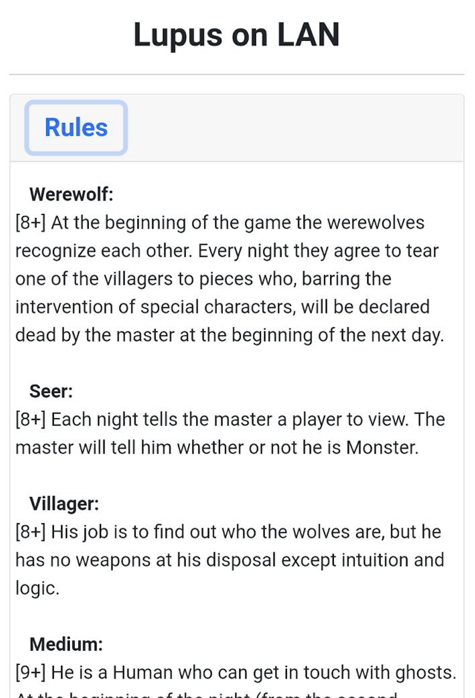
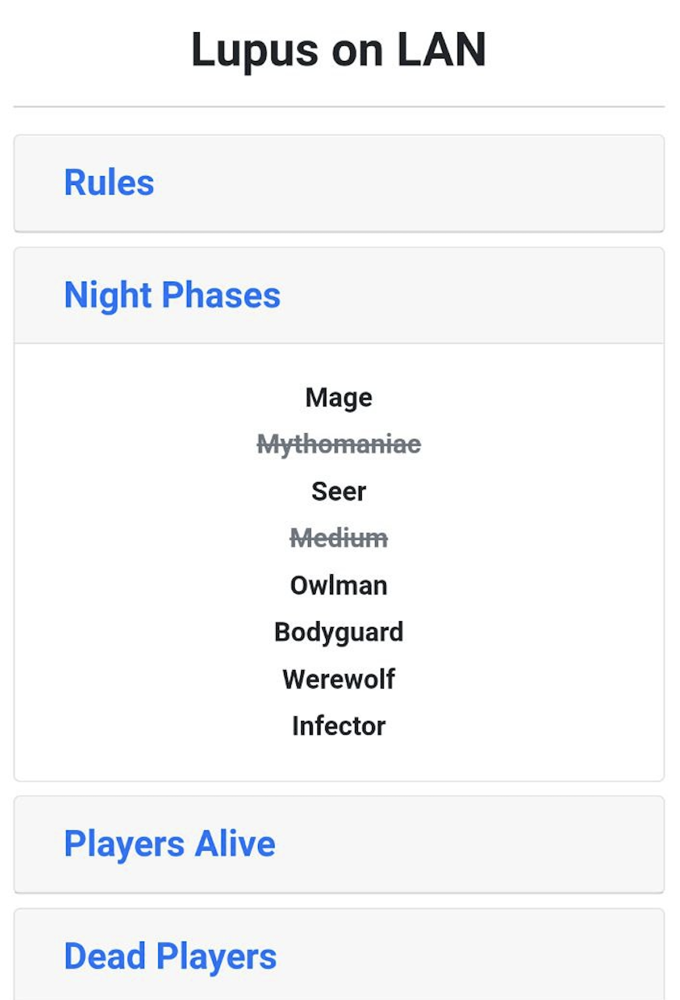
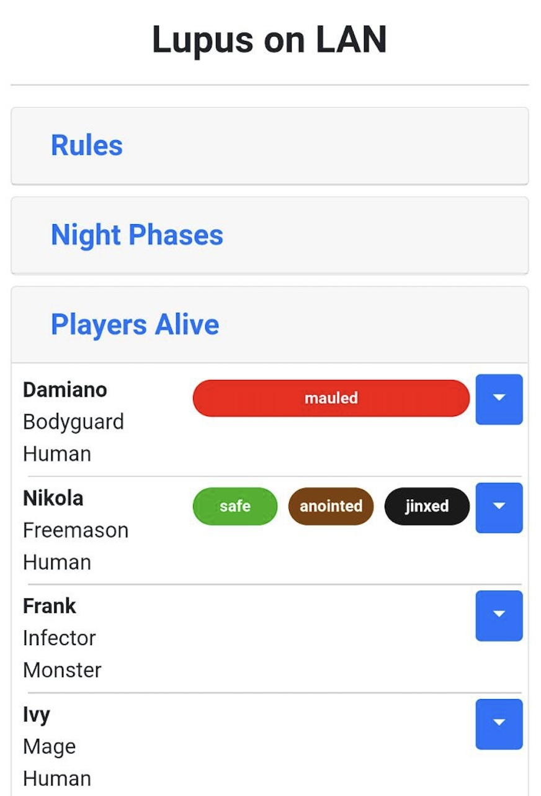
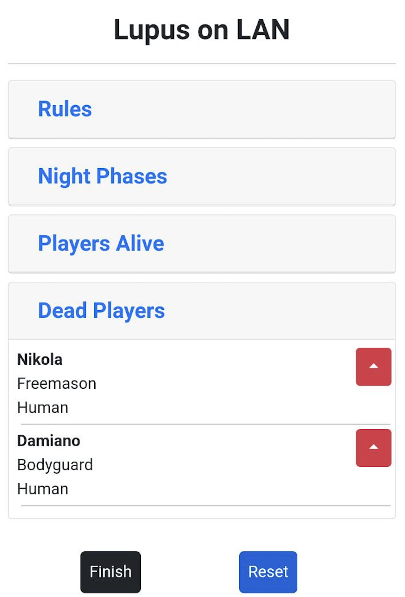

# LUPUS ON LAN

This is a simple web application for playing "Lupus in tabula" on LAN. It greatly simplifies the role of the master.

## Table of Contents

* [Build](#Build)
* [Quick Start](#QuickStart)
* [Features](#features)
* [Images](#images)
* [Authors](#authors)
* [License](#license)

---
## Build
Dependencies:
~~~
pip3 install --user flask
~~~
Launch:
~~~
./src/main.py en
or
./src/main.py it
~~~
Note: the default port in 5000. You can also specify IP and PORT:
~~~
./src/main.py LANG IP PORT
~~~

---
## Quick Start
1. Set roles in roles.json
2. Launch: ./src/main.py en
3. Go to http://your_ip:your_port/

---
## Features
- role assignment
- players with the same role know who the others are (e.g. Freemasons)
- the master sees everyone's role and the race to tell the Seer.
- the master can mark the status of each player

---
## Images

---
## Authors

- **Enrico Sgarbanti** [@**Envq**](https://github.com/Envq)

- **Michele Roselli** [@**jimmyverdoora**](https://github.com/jimmyverdoora)

---
## License

This project is licensed under the GPL v3 License - see the [LICENSE.md](LICENSE.md) file for details